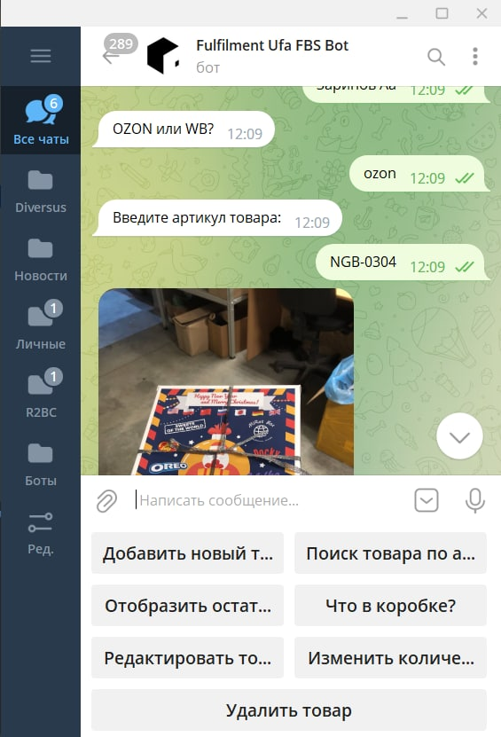
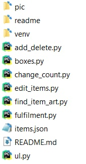

 
Выполнил работу: Кремешный Роман (sokems@mail.ru)

## Описание бота: 
Информационный внутренний складской бот, который разработан для фуллфиментов (без клиентской части). Бот позволяет вести учет и поиск складских позиций.

## Ссылка на бот в телеграме:
https://t.me/fulfilment_ufa_bot

## Возможности бота: 
+ Добавление нового товара
+ Поиск товара по артикулу
+ Отобращение остатков у клиента
+ Отображание товаров в той или иной коробке
+ Редактирование товаров
+ Изменение количества
+ Удаление товара

## Описание архитектуры:

- pic - папка, в которой храняться фото товаров 
- readme - дополнительный файлы для REAMDME.md 
- venv - локальное окружение 
- README.md - в представлении не нуждается 
- items.json - локальная база данных 
- модули.py - модули программы
- diag.drawio - блок-схема программы

### Модули:
1. fulfilment - основной модуль. Синтаксис Telebot'а
2. add_delete - модуль добавления новых и удаления товаров
3. boxes - выводит информацию по коробкам
4. change_count - изменяет количество товаров на складе
5. edit_items - редактирует информацию по товарам
6. find_item_art - определяет ID товара и выводит информацию по исходным данным
7. ul - формирует список ИП, отображает информацию по заданному ИП

